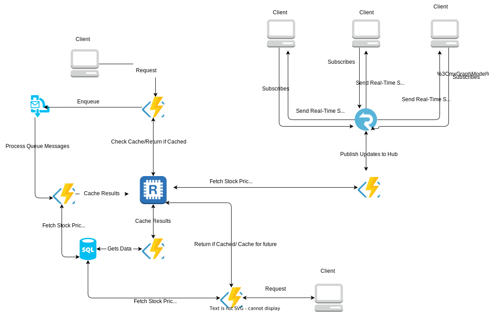

# Stock Price Service Documentation

## 1. Overview
The Stock Price Service is designed to provide stock price data to consumer applications through different interfaces. The service supports real-time updates via SignalR, batch requests via Service Bus queues, and direct queries via HTTP APIs.

This project leverages various **Azure Cloud resources** such as **Azure Functions**, **Azure Service Bus**, **Azure SignalR**, and (optionally) **Redis Cache** for performance optimization.


## 2. System Overview

### 2.1 Service Bus Queue Process (Left Side)

This part of the system represents the background processing of stock price requests using the **Service Bus Queue**. It's designed to handle scenarios where data is not immediately available in the cache, ensuring the system can scale and handle large or complex requests asynchronously.

### 2.2 SignalR Real-Time Updates (Right Side)

This section of the system represents the **real-time data updates** provided to clients using **SignalR**. Clients that subscribe to updates will receive notifications as soon as stock prices are updated, ensuring they always have the most up-to-date data.

### 2.3 HTTP-Based (Bottom Section)
This section of the system handles on-demand stock price requests via an HTTP API. Clients that don't subscribe to continuous real-time updates through SignalR can use this API to get the latest stock prices as needed. This API fetches stock prices either from the cache or from the database if not cached, and responds immediately with the requested data.




## 3. How to Start the Project

### 3.1 Set Up Local Development Environment
To run the project locally, ensure you have the following configuration files with the correct settings:

#### Example `local.settings.json` and `appsettings.json`
```json
{
  "IsEncrypted": false,
  "Values": {
    "AzureWebJobsStorage": "UseDevelopmentStorage=true",
    "FUNCTIONS_WORKER_RUNTIME": "dotnet-isolated",
    "ServiceBusConnection": "<your-service-bus-connection-string>",
    "AzureSignalRConnectionString": "<your-signalr-connection-string>",
    "RedisCacheConnection": "<your-redis-connection-string>"
  }
}
{
  "IsEncrypted": false,
  "Values": {
    "ServiceBusConnection": "<your-service-bus-connection-string>"
  }
}
```

## 4. Technologies Used

This project incorporates a variety of technologies and Azure services to provide a scalable, high-performance stock price service:

### 4.1 **.NET 8 (Isolated Process)**:
- **Why is used?**: Provides greater control over the execution environment while ensuring scalability, performance, and ease of development for serverless applications.

### 4.2 **Azure Functions**:
- **Why is used?**: Handles all incoming stock price requests and timers for periodic updates. Automatically scales with demand and integrates seamlessly with other Azure services such as SignalR and Service Bus.

### 4.3 **Azure Service Bus**:
- **Why is used?**: Used to handle large-scale, batch stock price requests asynchronously. By placing requests in a queue, Service Bus allows the system to process them at its own pace, ensuring the system remains responsive and scalable.

### 4.4 **Azure SignalR**:
- **Why is used?**: Provides real-time updates to connected clients whenever stock prices change. This ensures that clients receive immediate notifications without having to constantly poll the server.

### 4.5 **Azure Redis Cache**:
- **Why is used?**:  Azure Redis Cache is used to store stock prices, reducing the need for repeated database queries. By caching frequently requested data, such as stock prices, the API can serve responses faster. This reduces the load on the database and enhances overall system performance, particularly when the same data is requested multiple times.

### 4.6 **Azure Timer Triggers**:
- **Why is used?**: Ensures that stock prices are regularly updated in the background without manual intervention. The Timer Trigger is set to update stock prices in the system periodically.

### 4.7 **Azure Cloud Resources**:
- **Why is used?**: Azure’s serverless architecture allows automatic scaling, high availability, and easy integration between services, reducing the complexity of managing infrastructure manually. All necessary resources for the Stock Price Service, including Azure functions, Service Bus, SignalR, and Redis, are deployed and managed within the Azure environment.
